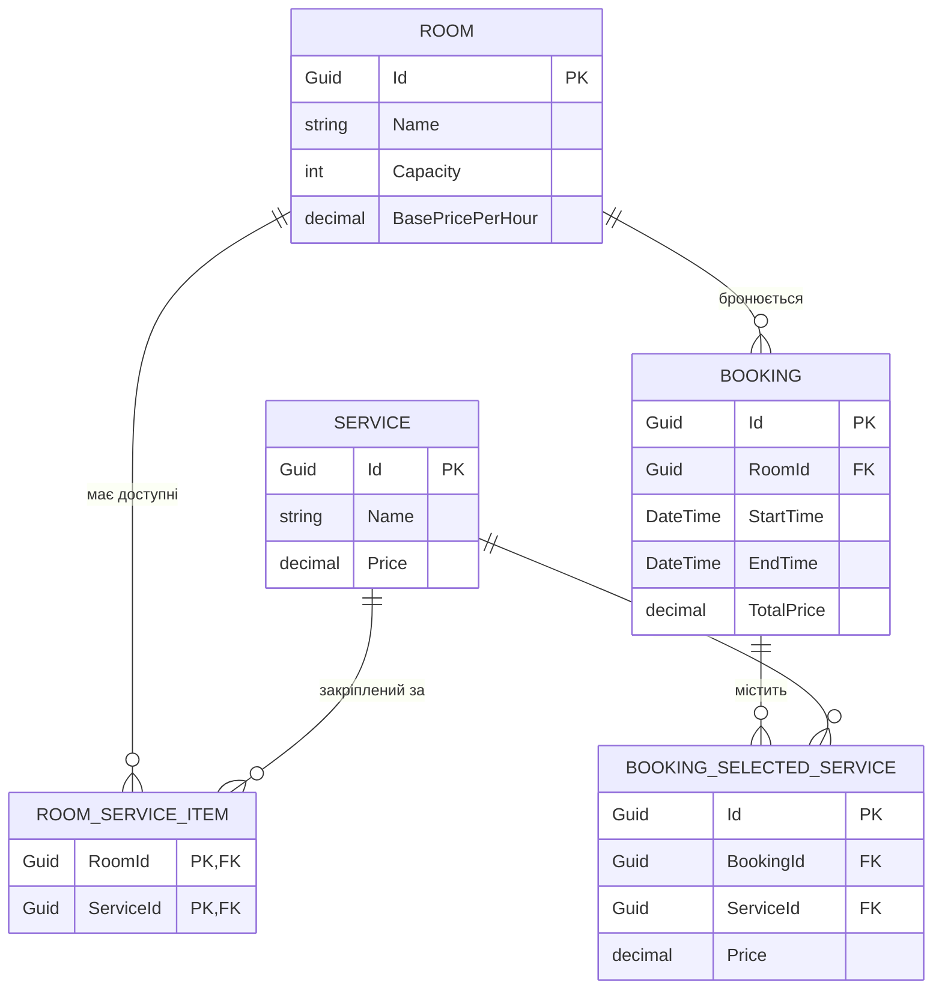

# 🏢 Conference Room Booking API

> **RESTful API на базі ASP.NET Core (.NET 10)** для автоматизації управління конференц-залами, оформлення бронювань з динамічним розрахунком вартості оренди та формування комплексної аналітичної звітності.

[](https://dotnet.microsoft.com/)
[](https://learn.microsoft.com/dotnet/csharp/)
[](https://learn.microsoft.com/ef/core/)
[](https://www.sqlite.org/)
[-85EA2D?logo=swagger&logoColor=black)](http://localhost:5162/swagger)
[](ConferenceBooking.Tests)

---

## 📑 Зміст

1. [Опис бізнес-завдань](#-опис-бізнес-завдань)
2. [Архітектура та технічні рішення](#-архітектура-та-технічні-рішення)
3. [Динамічне ціноутворення](#-динамічне-ціноутворення)
4. [Специфікація API (Endpoints)](#-специфікація-api-endpoints)
5. [Схема бази даних](#-схема-бази-даних)
6. [Швидкий старт та запуск](#-швидкий-старт-та-запуск)
7. [Тестування та якість коду](#-тестування-та-якість-коду)
8. [Структура проєкту](#-структура-проєкту)

---

## 🎯 Опис бізнес-завдань

Система вирішує завдання комплексної автоматизації коворкінгів, бізнес-центрів та готельних комплексів з надання конференц-сервісу:

* **Керування фондом залів (CRUD)**: Створення, конфігурація місткості, базових ставок оренди та каталогу закріплених додаткових послуг (Wi-Fi, мультимедійні проєктори, звукове обладнання, кейтеринг, системи відеоконференцзв'язку).
* **Пошук вільних приміщень**: Пошук залів під задану кількість учасників на визначений проміжок часу з математичним контролем відсутності перетинів з існуючими замовленнями.
* **Гнучке динамічне ціноутворення**: Автоматичний погодинний розрахунок вартості оренди на основі часових зон доби (ранкові та вечірні знижки, пікова націнка в обідній час, стандартна ставка в робочі години та вночі) плюс фіксація цін обраних супутніх послуг.
* **Збереження зліпка цін (Price Snapshotting)**: Фіксація вартості кожної послуги в момент замовлення, що гарантує незмінність фінансової історії у разі майбутньої зміни тарифів у каталозі.
* **Аналітика та звітність**:
  - *Фінансовий звіт*: загальна виручка, кількість бронювань та середній чек по кожному залу.
  - *Звіт завантаженості*: облік фактично заброньованих годин та коефіцієнт утилізації простору.
  - *Аналітика послуг*: рейтинг популярності та прибутковості додаткових послуг.

---

## 🏗 Архітектура та технічні рішення

Проєкт спроєктовано за принципами **Clean Architecture (Чиста Архітектура)** та **Domain-Driven Design (DDD)**:

```
┌─────────────────────────────────────────────────────────────┐
│                      ConferenceBooking.Api                  │  -> REST API, Swagger/OpenAPI, Middlewares
└──────────────────────────────┬──────────────────────────────┘
                               │
┌──────────────────────────────▼──────────────────────────────┐
│                  ConferenceBooking.Application              │  -> DTOs, Інтерфейси, Сервіси (Rooms, Bookings, Reports)
└──────────────────────────────┬──────────────────────────────┘
                               │
┌──────────────────────────────▼──────────────────────────────┐
│                    ConferenceBooking.Domain                 │  -> Сутності, Domain Exceptions, PricingDomainService
└──────────────────────────────▲──────────────────────────────┘
                               │
┌──────────────────────────────┴──────────────────────────────┐
│                ConferenceBooking.Infrastructure             │  -> EF Core, AppDbContext, Репозиторії, SeedData
└─────────────────────────────────────────────────────────────┘
```

### Ключові технічні рішення:
1. **Розділення обов'язків (Separation of Concerns)**:
   - `Domain`: ізольоване ядро без зовнішніх залежностей. Містить сутності `Room`, `Booking`, `Service`, `BookingSelectedService`, правила валідації та чисту математику ціноутворення (`PricingDomainService`).
   - `Application`: сценарії використання системи (`RoomService`, `BookingService`, `ReportService`), контракти DTO з валідаційними атрибутами DataAnnotations.
   - `Infrastructure`: доступ до даних через EF Core, контекст `AppDbContext` з Fluent API мапінгом, репозиторії (`RoomRepository`, `BookingRepository`, `ServiceRepository`) та ідемпотентна ініціалізація `SeedData`.
   - `Api`: REST-контролери, налаштування Swagger з підключенням XML-коментарів, глобальний `ExceptionHandlingMiddleware`.
2. **Алгоритм перевірки перетину інтервалів (Time Interval Collision)**:
   Застосовано математичну умову неперетинності:
   $$\text{Collision} \iff (\text{Booking.StartTime} < \text{RequestedEnd}) \land (\text{Booking.EndTime} > \text{RequestedStart})$$
   Це гарантує коректну обробку повного включення, часткового перекриття зліва чи справа та точного збігу меж без помилок граничних значень.
3. **Глобальна обробка винятків (Exception Handling Middleware)**:
   Перехоплює доменні винятки (`NotFoundException`, `RoomUnavailableException`, `DomainValidationException`) та трансформує їх у стандартизовані HTTP-відповіді (`404 Not Found`, `400 Bad Request`, `500 Internal Server Error`) у форматі JSON.
4. **Повна Swagger / OpenAPI документація**:
   Автоматична генерація та підключення XML-документації з усіх трьох шарів (`Api`, `Application`, `Domain`), детальні схеми моделей, описи параметрів, статус-кодів та прикладів.

---

## 💰 Динамічне ціноутворення

Підсумкова вартість бронювання розраховується за формулою:
$$\text{Total Price} = \sum_{i} \left( \text{BasePricePerHour} \times \Delta t_i \times \text{Modifier}_i \right) + \sum_{s} \text{ServicePrice}_s$$

### Тарифна сітка доби:

| Часовий інтервал | Тип тарифу | Коефіцієнт | Опис |
| :--- | :--- | :---: | :--- |
| **06:00 – 09:00** | Ранкова знижка 10% | `0.90` | Заохочення ранніх заходів та підготовки |
| **09:00 – 12:00** | Стандартний тариф | `1.00` | Базовий робочий ранок |
| **12:00 – 14:00** | Піковий час (+15%) | `1.15` | Найвищий попит на заходи під час бізнес-ланчів |
| **14:00 – 18:00** | Стандартний тариф | `1.00` | Стандартний робочий день |
| **18:00 – 23:00** | Вечірня знижка 20% | `0.80` | Вечірній час зі зниженим попитом |
| **23:00 – 06:00** | Базова ставка | `1.00` | Нічний тариф |

> 🕒 *Алгоритм автоматично нарізає час замовлення на сегменти з точністю до хвилин та коректно розбиває інтервали при переході через північ на декілька днів.*

---

## 📡 Специфікація API (Endpoints)

### 🚪 1. Управління залами (`/api/rooms`)
| Метод | Маршрут | Опис | Відповідь |
| :--- | :--- | :--- | :---: |
| `GET` | `/api/rooms` | Отримати повний список залів із закріпленими послугами | `200 OK` |
| `GET` | `/api/rooms/{id}` | Отримати детальні дані залу за унікальним GUID | `200 OK`, `404 Not Found` |
| `POST` | `/api/rooms` | Створити новий конференц-зал та закріпити послуги | `201 Created`, `400 Bad Request` |
| `PUT` | `/api/rooms/{id}` | Оновити параметри залу та список послуг | `200 OK`, `404 Not Found` |
| `DELETE` | `/api/rooms/{id}` | Видалити зал | `204 No Content`, `404 Not Found` |
| `GET` | `/api/rooms/available` | Пошук вільних залів (`startTime`, `durationMinutes`, `capacity`) | `200 OK` |

### 📅 2. Бронювання (`/api/bookings`)
| Метод | Маршрут | Опис | Відповідь |
| :--- | :--- | :--- | :---: |
| `POST` | `/api/bookings` | Оформити бронювання з автоматичним динамічним розрахунком | `201 Created`, `400 Bad Request`, `404 Not Found` |

### 📊 3. Аналітичні звіти (`/api/reports`)
| Метод | Маршрут | Опис | Параметри | Відповідь |
| :--- | :--- | :--- | :--- | :---: |
| `GET` | `/api/reports/revenue` | Фінансовий звіт: виручка, кількість та середній чек по залах | `from`, `to` | `200 OK` |
| `GET` | `/api/reports/utilization` | Звіт завантаженості: сумарний час оренди (години) | `from`, `to` | `200 OK` |
| `GET` | `/api/reports/services` | Рейтинг популярності та прибутковість послуг | `from`, `to` | `200 OK` |

---

## 🗄 Схема бази даних

Спроєктовано 4 взаємопов'язані таблиці з реляційними зв'язками та обмеженнями цілісності:



* **Cascade Deletes**: При видаленні залу видаляються його прив'язки до послуг та бронювання.
* **Restrict Deletes**: Заборонено випадкове видалення послуги з довідника, якщо вона зафіксована в історії бронювань (`BookingSelectedService`).

---

## 🚀 Швидкий старт та запуск

### Вимоги:
* [.NET 10 SDK](https://dotnet.microsoft.com/download/dotnet/10.0)

### 1. Клонування репозиторію
```bash
git clone <URL_РЕПОЗИТОРІЮ>
cd backend_task
```

### 2. Запуск сервера API
```bash
dotnet run --project ConferenceBooking.Api
```
Після старту сервер автоматично створить базу даних `conference.db` (SQLite) та наповнить її тестовими даними (зали, послуги, історія бронювань).

* **Інтерактивна документація Swagger UI**: [http://localhost:5162/swagger](http://localhost:5162/swagger)
* **OpenAPI специфікація JSON**: [http://localhost:5162/swagger/v1/swagger.json](http://localhost:5162/swagger/v1/swagger.json)

---

## 🧪 Тестування та якість коду

У проєкті реалізовано 25 модульних тестів (xUnit) з покриттям усіх ключових доменних та бізнес-сценаріїв:

```bash
dotnet test
```

### Покриті сценарії:
- **PricingDomainServiceTests**:
  - Розрахунок стандартних годин без послуг.
  - Ранкова знижка 10% (06:00–09:00).
  - Пікова націнка 15% (12:00–14:00).
  - Вечірня знижка 20% (18:00–23:00).
  - Розрахунок інтервалу на межі двох тарифних зон (нарізання часток).
  - Багатозонні та багатоденні замовлення.
  - Додавання фіксованої вартості послуг.
  - Дробові інтервали (наприклад, 30 хвилин).
  - Валідація некоректного часу (`EndTime <= StartTime`).
- **BookingServiceTests**:
  - Успішне створення бронювання з фіксацією цін.
  - Викидання `NotFoundException` при неіснуючому залі.
  - Викидання `RoomUnavailableException` при спробі повторного бронювання на зайнятий час.
  - Викидання `DomainValidationException` при спробі замовити послугу, якої немає в даному залі.
- **RoomServiceTests**:
  - CRUD-операції над залами та зв'язками з послугами.
  - Пошук доступних залів за місткістю та часом.
- **ReportServiceTests**:
  - Агрегація виручки та розрахунок середнього чека.
  - Розрахунок годин утилізації залів.
  - Сортування та підрахунок популярності додаткових послуг.

---

## 📁 Структура проєкту

```text
d:\Projects\backend_task
├── ConferenceBooking.Domain/            # Доменний шар (без зовнішніх залежностей)
│   ├── Entities/                        # Room, Booking, Service, RoomServiceItem, BookingSelectedService
│   ├── Exceptions/                      # NotFoundException, RoomUnavailableException, DomainValidationException
│   └── Services/                        # IPricingDomainService, PricingDomainService
├── ConferenceBooking.Application/       # Аплікаційний шар бізнес-логіки
│   ├── DTOs/                            # RoomDtos, BookingDtos, ReportDtos, ServiceDtos
│   ├── Interfaces/                      # Інтерфейси сервісів та репозиторіїв
│   └── Services/                        # RoomService, BookingService, ReportService
├── ConferenceBooking.Infrastructure/    # Шар інфраструктури та доступу до даних
│   ├── Data/                            # AppDbContext (Fluent API), SeedData (демо-дані)
│   └── Repositories/                    # RoomRepository, BookingRepository, ServiceRepository
├── ConferenceBooking.Api/               # Шар представлення (ASP.NET Core Web API)
│   ├── Controllers/                     # RoomsController, BookingsController, ReportsController
│   ├── Middleware/                      # ExceptionHandlingMiddleware
│   └── Program.cs                       # Конфігурація DI, Swagger OpenAPI з XML-доками
├── ConferenceBooking.Tests/             # Модульні тести (xUnit)
└── README.md                            # Документація проєкту
```
